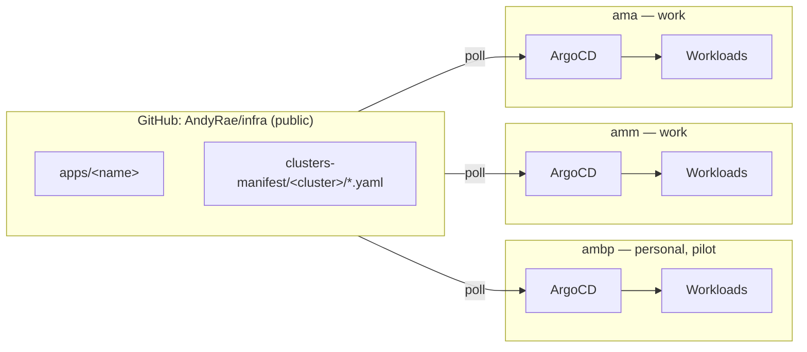

# infra — K8s GitOps Fleet

A real (VM-based) k3s cluster on each of several macOS machines. Each cluster
runs its own ArgoCD instance, pulling from this single shared repo. Adding an
app here makes it available to declare on any/all clusters, the way dotfiles
propagate config across machines. Each cluster only ever *pulls* — nothing
needs to reach into a laptop from outside, so machines keep working
independently if another is offline.

## Architecture

| Concern | Choice | Why |
|---|---|---|
| VM runtime | **Colima**, dedicated `--profile fleet` | Same tool used daily for docker, kept on a separate profile so wiping/rebuilding the fleet cluster never touches normal `docker build`/`docker run` work. |
| Kubernetes distro | **k3s** | Single binary, ships with `local-path` storage and Traefik out of the box. |
| GitOps topology | **Decentralized** — one ArgoCD instance per cluster, each polling this repo | A central "hub" ArgoCD would need stable inbound access to every laptop, which laptops don't offer. |
| Manifest tooling | **Helm** where a solid upstream chart exists (thin per-app umbrella chart wrapping it as a dependency, one values file per cluster); **Kustomize base + overlays** for bespoke apps with no good chart (e.g. `hello`) | Reuse upstream chart maintenance instead of hand-rolling StatefulSets/CRDs. Per-cluster differences are just `values/<cluster>.yaml`. |
| App composition | **App-of-apps**, one hand-written `Application` CR per app per cluster | `ApplicationSet` (git directory generator) would remove the duplication — worth adopting once the pattern outgrows hand-written files, see Roadmap. |
| Secrets | **Sealed Secrets**, one controller per cluster, one `SealedSecret` per app per cluster | Avoids building/hosting a custom ArgoCD repo-server image (the SOPS+ksops alternative needs one). Each cluster's controller has its own keypair — a secret sealed for one cluster won't decrypt on another, which is fine here since each cluster's Postgres etc. is an independent instance with independent data anyway. |
| Repo visibility | **Public** | No secret material is ever committed in plaintext (Sealed Secrets ciphertext either way) — the only real cost is exposing cluster topology/hostnames, an accepted tradeoff. Upside: ArgoCD needs zero repo credentials, plain anonymous HTTPS clone. |



## Repo layout

```
infra/
├── README.md
├── clusters/<cluster>/root-app.yaml       # app-of-apps root, applied once manually per cluster
├── clusters-manifest/<cluster>/*.yaml     # one Application CR per app running on this cluster
└── apps/
    ├── postgres/                          # Helm umbrella chart
    │   ├── Chart.yaml                     # declares the upstream chart as a dependency, pinned version
    │   ├── Chart.lock                     # committed; vendored charts/*.tgz is .gitignore'd
    │   └── values/<cluster>.yaml          # per-cluster resources, storage size, sealed secrets (extraObjects)
    ├── promstack/                         # same umbrella pattern, wraps kube-prometheus-stack
    │   └── ...
    └── hello/                             # no good upstream chart for a smoke-test Deployment — Kustomize instead
        ├── base/
        └── overlays/<cluster>/
```

Rule of thumb: **`apps/`** is "what exists and how to run it." **`clusters-manifest/`** is "which cluster runs which app." Adding an app everywhere = add it once under `apps/`, drop one `Application` file per cluster into `clusters-manifest/`. An empty (or missing) `clusters-manifest/<cluster>/` entry for an app means it doesn't run there — nothing else to configure.

## Cluster status

| Machine | Role | k3s | ArgoCD | Apps |
|---|---|---|---|---|
| `ambp` | personal MacBook Pro, pilot | `v1.35.0+k3s1` | `v3.4.5` | `hello`, `postgres`, `promstack` |
| `amm` | work laptop | not yet bootstrapped | — | — |
| `ama` | work laptop | not yet bootstrapped | — | — |

## Bootstrapping a new machine

```bash
brew install colima kubectl helm argocd kubeseal

# Dedicated profile, isolated from everyday docker use. Pre-writing colima.yaml and
# starting bare did NOT work on colima 0.10.3 — it silently ignored the file and used
# defaults. Pass everything as explicit flags instead:
colima start --profile fleet --cpu 4 --memory 8 --disk 60 \
  --kubernetes --kubernetes-version v1.35.0+k3s1 \
  --k3s-arg='--write-kubeconfig-mode=644'
kubectl config rename-context colima-fleet <cluster-name>   # amm | ama

# ArgoCD — imperative, one-time bootstrap (avoids a chicken-and-egg problem; everything
# after this point is declarative). v3.4.5 is current as of this writing — check for a
# newer stable before installing and keep the pin identical across machines.
kubectl --context <cluster-name> create namespace argocd
kubectl --context <cluster-name> apply --server-side --force-conflicts -n argocd \
  -f https://raw.githubusercontent.com/argoproj/argo-cd/v3.4.5/manifests/install.yaml
# --server-side is required: the applicationsets.argoproj.io CRD is too large for
# client-side apply's kubectl.kubernetes.io/last-applied-configuration annotation
# (262144-byte limit). This class of error recurs — see Gotchas.

kubectl --context <cluster-name> -n argocd port-forward svc/argocd-server 8080:443 &
argocd login localhost:8080 --username admin --insecure \
  --password "$(kubectl --context <cluster-name> -n argocd get secret argocd-initial-admin-secret -o jsonpath='{.data.password}' | base64 -d)"

# Sealed Secrets controller — also imperative, one-time. Each cluster's controller
# generates its own keypair on first start; nothing to copy between machines.
helm repo add sealed-secrets https://bitnami.github.io/sealed-secrets
helm install sealed-secrets sealed-secrets/sealed-secrets \
  --kube-context <cluster-name> -n kube-system \
  --set-string fullnameOverride=sealed-secrets-controller

# Bootstrap this cluster's app-of-apps root — the only manual kubectl apply you'll
# ever run again for this cluster.
kubectl --context <cluster-name> apply -f clusters/<cluster-name>/root-app.yaml
```

Then, for each app already in `apps/` that should run on the new cluster: copy
an existing `values/<other-cluster>.yaml` to `values/<cluster-name>.yaml`
(adjust resources/storage), re-seal any secrets it needs against the new
cluster's controller (see below), and drop the `Application` file into
`clusters-manifest/<cluster-name>/`.

## Adding an app

1. `mkdir -p apps/<name>/values`, write `apps/<name>/Chart.yaml` as a thin
   umbrella chart depending on the upstream chart (Helm repo or `oci://`).
2. `helm dependency update apps/<name>` — generates `Chart.lock` (commit it;
   `apps/**/charts/*.tgz` is gitignored).
3. Write `apps/<name>/values/<cluster>.yaml` with per-cluster
   resources/storage/etc.
4. If the app needs a secret (e.g. a DB password), generate and seal it
   against the target cluster's controller, then embed the `SealedSecret`
   directly in that cluster's values file via the chart's `extraObjects`:
   ```bash
   kubectl create secret generic <name> -n <namespace> --dry-run=client -o yaml \
     --from-literal=<key>=<value> \
     | kubeseal --context <cluster-name> --controller-namespace kube-system \
         --controller-name sealed-secrets-controller --format yaml
   ```
   Paste the output's `spec:` block under an `extraObjects` entry in
   `values/<cluster>.yaml`, and point the chart's `existingSecret`-style
   value at that Secret's name. **Double-check indentation** — `template:`
   must nest *inside* `spec:`, not sit as a sibling of it (easy typo, see
   Gotchas).
5. `helm template apps/<name> -f apps/<name>/values/<cluster>.yaml` locally
   before pushing, to catch rendering mistakes early.
6. Write `clusters-manifest/<cluster>/<name>-app.yaml` (an ArgoCD
   `Application` pointing `spec.source.path` at `apps/<name>` with
   `helm.valueFiles: [values/<cluster>.yaml]`). Push — the cluster's root
   Application picks it up and syncs automatically, no further `kubectl
   apply` needed.

If the app has no decent upstream Helm chart, use Kustomize instead:
`apps/<name>/base/` + `apps/<name>/overlays/<cluster>/`, and point the
Application's `spec.source.path` at the overlay directory (no `helm:` block).

## Gotchas (learned the hard way, worth knowing before touching another cluster)

- **Oversized CRDs break client-side apply.** Any CRD whose manifest exceeds
  262144 bytes (the `last-applied-configuration` annotation limit) fails with
  `metadata.annotations: Too long`. Fix: `kubectl apply --server-side
  --force-conflicts`. Hit this for both ArgoCD's own `applicationsets` CRD
  and several `kube-prometheus-stack` CRDs (`prometheuses`, `alertmanagers`,
  `thanosrulers`, `scrapeconfigs`, `alertmanagerconfigs`,
  `prometheusagents`).
- **ArgoCD-managed Helm CRDs fight server-side apply/diff at the Application
  level.** Setting `syncOptions: [ServerSideApply=true]` on an Application to
  work around the above can break diffing for *other* resources in the same
  app that have loosely-typed CRD schemas (e.g. `SealedSecret` — server-side
  diff errors with `.template: field not declared in schema`, even though
  the object applies fine). Cleanest fix for chart-vendored CRDs: install
  them once manually (`kubectl apply --server-side --force-conflicts`,
  as above), then set `spec.source.helm.skipCrds: true` on the Application so
  ArgoCD stops trying to reconcile them every sync — consistent with Helm's
  own documented behavior that a chart's `crds/` folder is only ever touched
  on first install, never on upgrade.
- **`prometheus-operator` doesn't notice CRDs added after it started.** It
  does CRD API discovery once at boot; if its own CRDs land after that
  (first-ever sync, chicken-and-egg with the point above), it silently never
  starts the `Prometheus`/`Alertmanager` controllers. Fix:
  `kubectl rollout restart deployment/<release>-kube-prometheus-operator`
  once the CRDs exist.
- **`argocd app sync --server-side` on the CLI forces SSA for that whole
  operation**, overriding whatever the Application's own `syncOptions` say.
  Don't reach for it out of habit — it reintroduces the diffing problem
  above even on Applications that don't need SSA at all.
- **Auto-generated chart passwords drift under GitOps.** Charts that
  generate a random password via a `lookup()`-guarded Helm template
  (common pattern for avoiding password rotation on every render) don't
  stay stable under ArgoCD: the repo-server doesn't resolve `lookup()`
  during diffing, so every diff pass can render a *new* random value, and
  self-heal can push it live. Whether this actually breaks anything depends
  on the chart: CloudPirates' `postgres` chart re-syncs the password into
  the database on every container start (so a drifted secret self-heals
  correctly), but stock Grafana only applies its admin-password env var
  when it first creates the admin user — a drifted secret there causes a
  real, silent login failure with no error anywhere. When wiring
  credentials for a new app, check which behavior its chart has, and give
  it a stable Sealed Secret (`existingSecret`) from the start rather than
  leaving the auto-generated password in place.
- **YAML indentation in `extraObjects` SealedSecret blocks is easy to get
  wrong and easy to misdiagnose.** A `template:` key that ends up as a
  sibling of `spec:` instead of nested inside it produces the exact same
  `.template: field not declared in schema` error as the server-side-diff
  issue above, which is a red herring — always check indentation first with
  `helm template ... | grep -A6 'kind: SealedSecret'` before chasing an
  ArgoCD/CRD explanation.

## Roadmap

- Replicate to `amm` and `ama` (see Bootstrapping above); once done, all
  three clusters sync independently from this repo, each running only what
  its `clusters-manifest/` directory declares.
- Next apps, same umbrella-chart-where-possible recipe: pick up wherever
  `postgres`/`promstack` left off.
- Collapse the per-cluster `Application` duplication into an
  `ApplicationSet` using a git directory generator over `apps/*` — replaces
  the hand-written `clusters-manifest/` files once the pattern outgrows
  manual management.
- ArgoCD notifications (webhook/Slack) on sync failure.
- Tailscale across the three machines, if remote access to any cluster's
  ArgoCD UI is wanted instead of local-only port-forward.
- Decide whether stateful data (Postgres) needs backup (Velero), or whether
  to just accept this is a rebuildable learning fleet and treat data as
  disposable.
- Optional stretch: turn one machine into a 2–3 node k3s cluster (extra Lima
  VMs joined as workers) for real experience with node draining,
  taints/tolerations, and scheduling.
